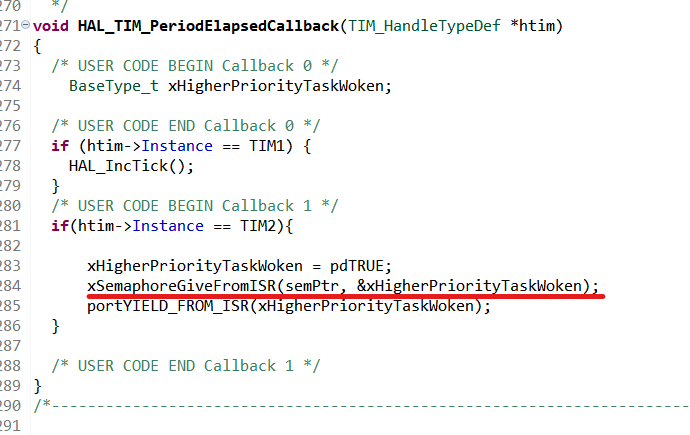
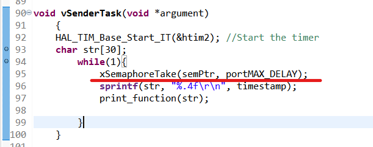

# InterruptDeferring

### 1. Fetching the timestamp at the interrupt handler.

---

### 2. The interrupt deferring can be done, by synchronizing the ISR with the Task using a binary semaphore.

---

### 3. Printing the timestamp in the deferred task

---

### 4. Here is the result
